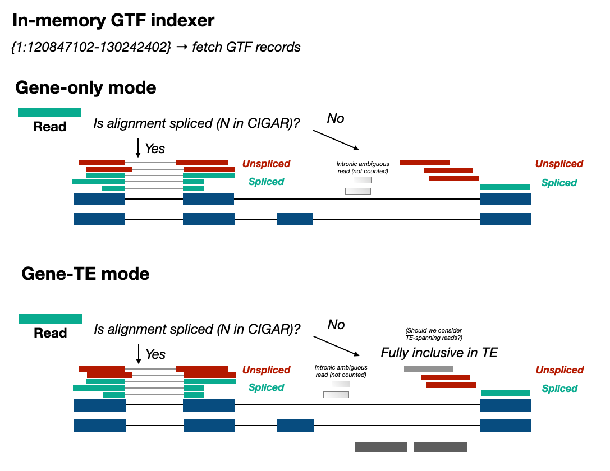

# A Rapid And Accurate single=cell RNA Counting Tool



## Usage

```
Usage:   bgtf count [options]

Arguments:
   Required arguments:
     -c          [PATH]   Cell barcode file 
     -i          [STRING] BAM tag of barcode. Default is CB 
     -g          [STRING] feature name to be counted 
     -r          [PATH]   Gene BGTF file 
   Optional arguments:
     -b          [PATH]   Input BAM file 
     -B          [PATH]   output gene annotation to a BAM file if set 
     -d          [PATH]   Input BAM directory 
     -m          [PATH]   RMSK BGTF file. Mask TE if set 
     -t          [INT]    n parallel thread if setted 
     -T          [INT]    n alignment to process in one thread. Default is 1000000 
```